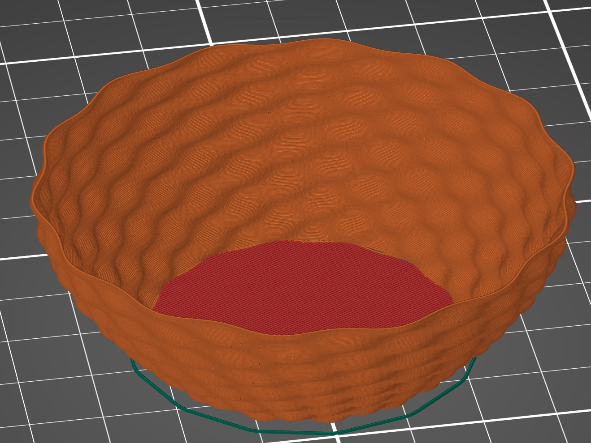

# mini basket

```javascript
var radius = 30;
var height = 50;
var points = 200;
var waves = 14;
var data = [];
for (var y=0; y<height; y++)
{
  data.push([]);
  for (var x=0; x<points; x++)
  {
    var alpha = x/points*Math.PI*2;
    var beta = x/points*waves*Math.PI*2;
    var r = radius*(0.7+0.5*Math.sin(y/height*90/180*Math.PI)) + Math.cos(beta+y*0.08)*Math.cos(y/8*Math.PI*2)*1;
    var point = {x:Math.cos(alpha)*r, y:Math.sin(alpha)*r, z:y/2};
    data[y].push(point);
  }
}
```

